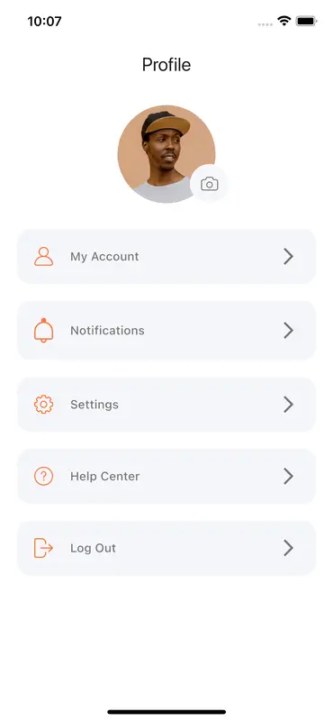
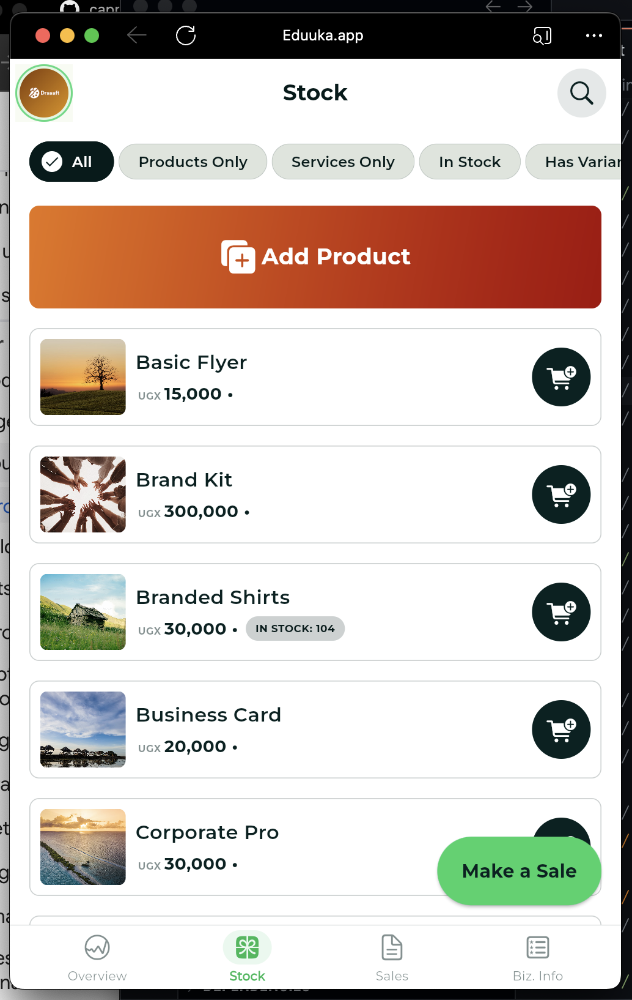
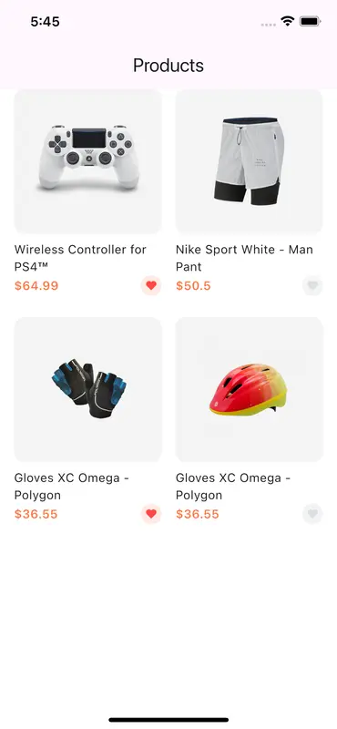
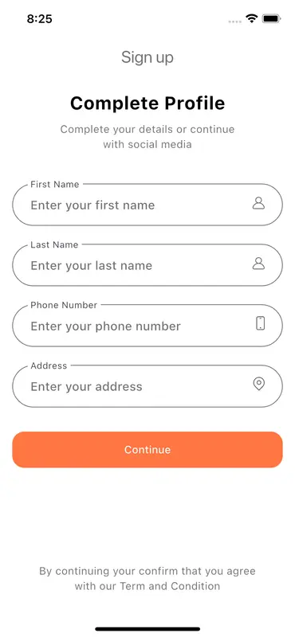

# 3-Day Flutter Training Roadmap

## From Zero to Building Complex Mobile Applications

---

## DAY 1: FLUTTER FUNDAMENTALS

### Session 1: Introduction to Flutter (60 min)

**Topics:**

- What is Flutter and why use it?
- Dart language essentials
- Flutter architecture overview
- Hot reload and development workflow

**Learning Objectives:**

- Understand Flutter's positioning in the mobile development ecosystem
- Grasp basic Dart syntax for Flutter development
- Comprehend Flutter's widget-based architecture

**Exercise:**
Create your first "Hello, Flutter!" app and experiment with hot reload.

---

### Session 2: Development Environment Setup (45 min)

**Topics:**

- Installing Flutter SDK
- Setting up IDE (VS Code or Android Studio)
- Creating and running a basic project
- Using Flutter DevTools

**Learning Objectives:**

- Configure a complete Flutter development environment
- Understand Flutter CLI commands
- Navigate the project structure

**Exercise:**
Set up development environment and run the starter template app on an emulator or physical device.

---

### Session 3: Flutter Widget Fundamentals (90 min)

**Topics:**

- Understanding widget tree
- Stateless vs. Stateful widgets
- Basic layout widgets (Container, Row, Column)
- Material Design widgets

**Learning Objectives:**

- Differentiate between widget types
- Create simple layouts using core widgets
- Apply the widget composition pattern

**Exercise:**
Build a profile card UI with photo, name, and description using various widgets.

---

### Session 4: Building a Simple UI (120 min)

**Topics:**

- Working with Text and Images
- Styling with BoxDecoration
- Responsive layouts
- Lists and grids

**Learning Objectives:**

- Apply styling to Flutter widgets
- Implement scrollable content
- Create responsive interfaces

**Exercise:**
Build a home screen with:

- App bar with title
- Featured card
- Scrollable list of items
- Each item containing image, headline, and brief description

Source: Stock Page in Eduuka.app [Flutter Library](https://eduuka.app)

---

## DAY 2: INTERMEDIATE FLUTTER

### Session 1: State Management Fundamentals (90 min)

**Topics:**

- Understanding app state
- setState and ephemeral state
- InheritedWidget and scoped state
- Introduction to Provider package

**Learning Objectives:**

- Identify different types of state in a Flutter app
- Update UI based on state changes
- Share state across widgets

**Exercise:**
Create a counter app with reset button and settings page that remembers preferences.

---

### Session 2: Navigation and Routing (60 min)

**Topics:**

- Navigator basics
- Named routes
- Passing data between screens
- Navigation patterns

**Learning Objectives:**

- Implement multi-screen navigation
- Pass and retrieve screen parameters
- Create consistent navigation experiences

**Exercise:**
Build a product catalog app with:

- Product list page
- Detail page that receives and displays product data
- Back navigation with proper state preservation

Source [Flutter Library](https://www.flutterlibrary.com/screens/shop-product-page)

---

### Session 3: Forms and User Input (60 min)

**Topics:**

- Form widgets
- Input validation
- Handling user gestures
- Dialog and modal interfaces

**Learning Objectives:**

- Create and validate forms
- Respond to user input
- Implement interactive UI elements

**Exercise:**
Create a contact form with:

- Name, email, phone fields with validation
- Dropdown for contact reason
- Submit button with loading state
- Success/error dialogs

Source [Flutter Library](https://www.flutterlibrary.com/screens/profile-edit-page)

---

### Session 4: API Integration (90 min)

**Topics:**

- HTTP requests in Flutter
- Working with JSON
- Async/await pattern
- Error handling

**Learning Objectives:**

- Make network requests to REST APIs
- Parse JSON responses into Dart objects
- Handle network errors gracefully

**Exercise:**
Make an API Call using http package to fetch and display data:

[Fetching Data from Internet](https://docs.flutter.dev/cookbook/networking/fetch-data)

---

## DAY 3: ADVANCED FLUTTER

### Session 1: Local Data Storage (75 min)

**Topics:**

- SharedPreferences for simple data
- SQLite and Floor/Moor
- Hive NoSQL database
- File storage

**Learning Objectives:**

- Persist app data between sessions
- Implement local database operations
- Choose appropriate storage solutions

**Exercise:**
Use SharedPreferences to save user preferences:

- Save and retrieve user info from the contact form above

[CookBook on Flutter Site](https://docs.flutter.dev/cookbook/persistence/key-value)

---

### Session 2: Animations and UI Polish (75 min)

**Topics:**

- Implicit animations
- Explicit animations with AnimationController
- Custom transitions
- Hero animations

**Learning Objectives:**

- Implement various animation types
- Create smooth transitions between states
- Enhance UI with motion

**Exercise:**
Show use case of the animations package:

- [animations](https://pub.dev/packages/animations)
- [flutter_animate](https://pub.dev/packages/flutter_animate)

---

### Session 3: Performance Optimization (60 min)

**Topics:**

- Widget rebuilding optimization
- Memory management
- App size optimization
- Performance profiling

**Learning Objectives:**

- Identify and resolve performance bottlenecks
- Measure app performance
- Apply best practices for efficient Flutter apps

**Exercise:**
Profile and optimize one of the previously built apps:

- Identify unnecessary rebuilds
- Implement const constructors

Show Use of Very Good Analysis Package to improve performance:

- [very_good_analysis](https://pub.dev/packages/very_good_analysis)

---

### Session 4: Final Project (150 min) for Personal or Group Work

**Topics:**

- Integrating multiple Flutter concepts
- Project structure for larger apps
- Testing and debugging
- Deployment preparation

**Learning Objectives:**

- Build a complete Flutter application
- Apply best practices from all sessions
- Troubleshoot common issues

**Exercise:**
Create an e-commerce app that integrates:

- Multiple screens with navigation
- Product listing with search and filter
- Shopping cart with state management
- User preferences with local storage
- API integration for products
- Animations for smooth UX
- Responsive design for different devices

---

## Post-Training Resources

- Flutter documentation: [flutter.dev/docs](https://flutter.dev/docs)
- Dart language tour: [dart.dev/guides/language/language-tour](https://dart.dev/guides/language/language-tour)
- Flutter GitHub repository: [github.com/flutter/flutter](https://github.com/flutter/flutter)
- Flutter community packages: [pub.dev](https://pub.dev)
- Flutter DevTools guide: [flutter.dev/docs/development/tools/devtools](https://flutter.dev/docs/development/tools/devtools)

---

Kindly star this repository if you find it useful. Your support helps us improve and create more resources for the community. Thank you!

Additionaly, Star [The Cupertino Icons Gallery](https://github.com/capps096github/cupertino_icons_gallery) that I creeated for the Flutter Community.

